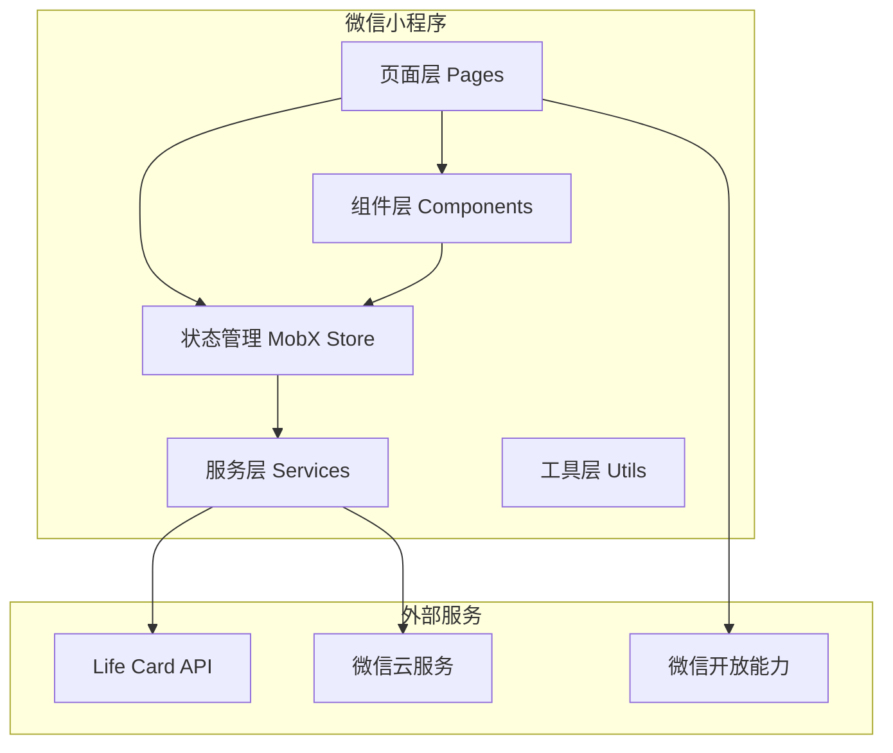

# Design Document: Life Card 微信小程序

## Overview

Life Card 微信小程序采用微信原生开发框架，结合现代化的组件设计和状态管理方案。小程序将通过 HTTPS 调用后端 Rust API，实现完整的人生体验卡片分享与交换功能。

### 技术选型

- **框架**: 微信小程序原生框架 + TypeScript
- **UI 组件库**: Vant Weapp
- **状态管理**: MobX-miniprogram
- **网络请求**: 封装 wx.request
- **图片上传**: 微信云存储或 OSS

## Architecture



### 目录结构

```
miniprogram/
├── app.ts                 # 小程序入口
├── app.json               # 全局配置
├── app.wxss               # 全局样式
├── pages/                 # 页面
│   ├── index/             # 首页 (Feed)
│   ├── discover/          # 发现页
│   ├── create/            # 创建卡片
│   ├── card-detail/       # 卡片详情
│   ├── profile/           # 个人中心
│   ├── my-cards/          # 我的卡片
│   ├── search/            # 搜索
│   ├── notifications/     # 通知
│   ├── user-profile/      # 他人主页
│   └── exchange/          # 交换管理
├── components/            # 公共组件
│   ├── card-item/         # 卡片列表项
│   ├── card-grid/         # 卡片网格
│   ├── user-avatar/       # 用户头像
│   ├── tag-selector/      # 标签选择器
│   ├── media-picker/      # 媒体选择器
│   ├── location-picker/   # 位置选择器
│   ├── comment-list/      # 评论列表
│   └── empty-state/       # 空状态
├── stores/                # MobX 状态管理
│   ├── user.ts            # 用户状态
│   ├── card.ts            # 卡片状态
│   ├── exchange.ts        # 交换状态
│   └── notification.ts    # 通知状态
├── services/              # API 服务
│   ├── request.ts         # 请求封装
│   ├── auth.ts            # 认证服务
│   ├── card.ts            # 卡片服务
│   ├── user.ts            # 用户服务
│   ├── exchange.ts        # 交换服务
│   └── upload.ts          # 上传服务
├── utils/                 # 工具函数
│   ├── storage.ts         # 本地存储
│   ├── format.ts          # 格式化
│   └── validator.ts       # 验证器
└── types/                 # TypeScript 类型
    ├── api.ts             # API 响应类型
    ├── card.ts            # 卡片类型
    └── user.ts            # 用户类型
```

## Components and Interfaces

### 核心服务接口

#### Request Service (请求封装)

```typescript
// services/request.ts
interface RequestConfig {
  url: string;
  method: 'GET' | 'POST' | 'PUT' | 'DELETE';
  data?: Record<string, any>;
  header?: Record<string, string>;
  needAuth?: boolean;
}

interface ApiResponse<T> {
  success: boolean;
  data?: T;
  message?: string;
  error_code?: string;
}

class RequestService {
  private baseUrl: string;
  
  // 发送请求，自动处理 token 和错误
  request<T>(config: RequestConfig): Promise<ApiResponse<T>>;
  
  // 便捷方法
  get<T>(url: string, params?: Record<string, any>): Promise<T>;
  post<T>(url: string, data?: Record<string, any>): Promise<T>;
  put<T>(url: string, data?: Record<string, any>): Promise<T>;
  delete<T>(url: string): Promise<T>;
}
```

#### Auth Service (认证服务)

```typescript
// services/auth.ts
interface LoginResult {
  token: string;
  user: UserProfile;
  isNewUser: boolean;
}

class AuthService {
  // 微信登录
  login(): Promise<LoginResult>;
  
  // 检查登录状态
  checkSession(): Promise<boolean>;
  
  // 获取存储的 token
  getToken(): string | null;
  
  // 登出
  logout(): void;
  
  // 刷新 token
  refreshToken(): Promise<string>;
}
```

#### Card Service (卡片服务)

```typescript
// services/card.ts
interface CardService {
  // 创建卡片
  createCard(data: CardCreateData): Promise<LifeCard>;
  
  // 获取卡片详情
  getCard(cardId: string): Promise<LifeCard>;
  
  // 更新卡片
  updateCard(cardId: string, data: CardUpdateData): Promise<LifeCard>;
  
  // 删除卡片
  deleteCard(cardId: string): Promise<void>;
  
  // 获取 Feed
  getFeed(cursor?: string, limit?: number): Promise<CardFeedResult>;
  
  // 搜索卡片
  searchCards(query: SearchQuery, page: number): Promise<CardSearchResult>;
  
  // 获取热门卡片
  getHotCards(timeRange: TimeRange, limit?: number): Promise<LifeCard[]>;
  
  // 获取随机卡片
  getRandomCards(count?: number, excludeIds?: string[]): Promise<LifeCard[]>;
  
  // 点赞/取消点赞
  likeCard(cardId: string): Promise<{ like_count: number }>;
  unlikeCard(cardId: string): Promise<{ like_count: number }>;
  
  // 评论
  addComment(cardId: string, content: string): Promise<Comment>;
  getComments(cardId: string, page: number): Promise<Comment[]>;
  deleteComment(commentId: string): Promise<void>;
  
  // 我的卡片
  getMyCards(page: number): Promise<PaginatedResult<LifeCard>>;
  getCollectedCards(page: number): Promise<PaginatedResult<LifeCard>>;
  
  // 文件夹管理
  createFolder(name: string): Promise<CardFolder>;
  getFolders(): Promise<CardFolder[]>;
  moveToFolder(cardId: string, folderId?: string): Promise<void>;
  deleteFolder(folderId: string): Promise<void>;
}
```

#### Exchange Service (交换服务)

```typescript
// services/exchange.ts
interface ExchangeService {
  // 创建交换请求
  createExchangeRequest(cardId: string): Promise<ExchangeRequest>;
  
  // 接受交换
  acceptExchange(exchangeId: string): Promise<ExchangeResult>;
  
  // 拒绝交换
  rejectExchange(exchangeId: string): Promise<void>;
  
  // 取消交换请求
  cancelExchange(exchangeId: string): Promise<void>;
  
  // 获取待处理请求
  getPendingRequests(): Promise<ExchangeRequest[]>;
  
  // 获取已发送请求
  getSentRequests(): Promise<ExchangeRequest[]>;
  
  // 获取交换历史
  getExchangeHistory(page: number): Promise<PaginatedResult<ExchangeRecord>>;
  
  // 获取交换价格
  getExchangePrice(cardId: string): Promise<PriceInfo>;
}
```

### MobX Store 设计

#### User Store

```typescript
// stores/user.ts
class UserStore {
  // 状态
  @observable isLoggedIn: boolean = false;
  @observable profile: UserProfile | null = null;
  @observable coinBalance: number = 0;
  @observable interestTags: string[] = [];
  
  // 计算属性
  @computed get displayName(): string;
  @computed get avatarUrl(): string;
  
  // Actions
  @action login(): Promise<void>;
  @action logout(): void;
  @action updateProfile(data: ProfileUpdateData): Promise<void>;
  @action refreshBalance(): Promise<void>;
  @action setInterestTags(tags: string[]): Promise<void>;
}
```

#### Card Store

```typescript
// stores/card.ts
class CardStore {
  // Feed 状态
  @observable feedCards: LifeCard[] = [];
  @observable feedCursor: string | null = null;
  @observable feedHasMore: boolean = true;
  @observable feedLoading: boolean = false;
  
  // 搜索状态
  @observable searchResults: LifeCard[] = [];
  @observable searchQuery: SearchQuery = {};
  
  // 当前卡片
  @observable currentCard: LifeCard | null = null;
  
  // Actions
  @action loadFeed(refresh?: boolean): Promise<void>;
  @action searchCards(query: SearchQuery): Promise<void>;
  @action loadCardDetail(cardId: string): Promise<void>;
  @action likeCard(cardId: string): Promise<void>;
  @action addComment(cardId: string, content: string): Promise<void>;
}
```

### 页面组件设计

#### 首页 (index)

```
┌─────────────────────────────────┐
│  Life Card          🔔  👤     │  <- 顶部导航
├─────────────────────────────────┤
│  [推荐] [热门] [附近]           │  <- Tab 切换
├─────────────────────────────────┤
│  ┌─────────────────────────┐   │
│  │  📷 卡片图片             │   │
│  │                         │   │
│  │  卡片标题               │   │
│  │  👤 创建者  ❤️ 123 💬 45 │   │
│  └─────────────────────────┘   │
│  ┌─────────────────────────┐   │
│  │  📷 卡片图片             │   │
│  │  ...                    │   │
│  └─────────────────────────┘   │
│           ...                   │
├─────────────────────────────────┤
│  🏠    🔍    ➕    📁    👤    │  <- 底部 TabBar
└─────────────────────────────────┘
```

#### 卡片详情页 (card-detail)

```
┌─────────────────────────────────┐
│  ←  卡片详情           ⋮  📤   │
├─────────────────────────────────┤
│  ┌─────────────────────────┐   │
│  │                         │   │
│  │     媒体轮播图          │   │
│  │                         │   │
│  └─────────────────────────┘   │
│                                 │
│  一天体验卡                     │  <- 卡片类型标签
│  卡片标题                       │
│                                 │
│  👤 用户头像  用户昵称    关注  │
│                                 │
│  卡片描述内容...                │
│                                 │
│  📍 北京市朝阳区                │
│  🏷️ 旅行 美食 探索              │
│  😊 开心 期待                   │
│                                 │
│  ─────────────────────────────  │
│  评论 (45)                      │
│  ┌─────────────────────────┐   │
│  │ 👤 用户A: 评论内容...    │   │
│  │ 👤 用户B: 评论内容...    │   │
│  └─────────────────────────┘   │
├─────────────────────────────────┤
│  ❤️ 123   💬 45   🔄 10金币交换 │
└─────────────────────────────────┘
```

#### 创建卡片页 (create)

```
┌─────────────────────────────────┐
│  ←  创建卡片              发布  │
├─────────────────────────────────┤
│  选择卡片类型                   │
│  ┌────┐ ┌────┐ ┌────┐ ┌────┐  │
│  │一天│ │一周│ │片段│ │时刻│  │
│  └────┘ └────┘ └────┘ └────┘  │
│                                 │
│  标题 *                         │
│  ┌─────────────────────────┐   │
│  │ 输入卡片标题...          │   │
│  └─────────────────────────┘   │
│                                 │
│  描述 *                         │
│  ┌─────────────────────────┐   │
│  │ 描述你的体验...          │   │
│  │                         │   │
│  └─────────────────────────┘   │
│                                 │
│  添加图片/视频                  │
│  ┌────┐ ┌────┐ ┌────┐        │
│  │ +  │ │ 📷 │ │ 📷 │        │
│  └────┘ └────┘ └────┘        │
│                                 │
│  📍 添加位置                    │
│  🏷️ 添加兴趣标签                │
│  😊 添加情绪标签                │
│  🔒 隐私设置: 公开 >            │
└─────────────────────────────────┘
```

## Data Models

### TypeScript 类型定义

```typescript
// types/card.ts

// 卡片类型枚举
type CardType = 'day_card' | 'week_card' | 'fragment_card' | 'moment_card';

// 隐私级别枚举
type PrivacyLevel = 'public' | 'friends_only' | 'exchange_only';

// 媒体类型
interface MediaItem {
  id: string;
  media_type: 'image' | 'video';
  url: string;
  thumbnail_url?: string;
  width?: number;
  height?: number;
}

// 位置信息
interface Location {
  name: string;
  latitude: number;
  longitude: number;
}

// 用户摘要
interface UserSummary {
  id: string;
  nickname: string;
  avatar_url?: string;
}

// 完整卡片
interface LifeCard {
  id: string;
  creator_id: string;
  creator?: UserSummary;
  card_type: CardType;
  title: string;
  description: string;
  media: MediaItem[];
  location?: Location;
  emotion_tags: string[];
  interest_tags: string[];
  privacy_level: PrivacyLevel;
  exchange_price: number;
  like_count: number;
  comment_count: number;
  exchange_count: number;
  is_liked: boolean;
  is_collected: boolean;
  created_at: string;
  updated_at: string;
}

// 创建卡片数据
interface CardCreateData {
  card_type: CardType;
  title: string;
  description: string;
  media?: MediaItem[];
  location?: Location;
  emotion_tags?: string[];
  interest_tags?: string[];
  privacy_level?: PrivacyLevel;
}

// 搜索查询
interface SearchQuery {
  keyword?: string;
  card_type?: CardType;
  interest_tags?: string[];
  latitude?: number;
  longitude?: number;
  radius_km?: number;
}

// Feed 结果
interface CardFeedResult {
  cards: LifeCard[];
  has_more: boolean;
  next_cursor?: string;
}

// 评论
interface Comment {
  id: string;
  card_id: string;
  user_id: string;
  user?: UserSummary;
  content: string;
  created_at: string;
}

// 文件夹
interface CardFolder {
  id: string;
  user_id: string;
  name: string;
  created_at: string;
}
```

```typescript
// types/user.ts

interface UserProfile {
  id: string;
  wechat_openid?: string;
  nickname: string;
  avatar_url?: string;
  bio?: string;
  age_range?: string;
  location?: string;
  card_count: number;
  follower_count: number;
  following_count: number;
  coin_balance: number;
  is_following?: boolean;
  created_at: string;
}

interface ProfileUpdateData {
  nickname?: string;
  bio?: string;
  age_range?: string;
  location?: string;
}

interface CoinTransaction {
  id: string;
  user_id: string;
  amount: number;
  transaction_type: 'earn' | 'spend';
  description: string;
  created_at: string;
}
```

```typescript
// types/exchange.ts

type ExchangeStatus = 'pending' | 'accepted' | 'rejected' | 'cancelled';

interface ExchangeRequest {
  id: string;
  requester_id: string;
  requester?: UserSummary;
  card_id: string;
  card?: LifeCardSummary;
  card_owner_id: string;
  status: ExchangeStatus;
  coin_cost: number;
  created_at: string;
  updated_at: string;
}

interface ExchangeResult {
  exchange_id: string;
  card: LifeCard;
  coins_transferred: number;
}

interface PriceInfo {
  base_price: number;
  popularity_bonus: number;
  total_price: number;
}
```

### 本地存储结构

```typescript
// utils/storage.ts

interface StorageKeys {
  TOKEN: 'life_card_token';
  USER_PROFILE: 'life_card_user';
  SEARCH_HISTORY: 'life_card_search_history';
  DRAFT_CARD: 'life_card_draft';
}

// Token 存储
interface TokenData {
  token: string;
  expires_at: number;
}

// 搜索历史
interface SearchHistoryItem {
  keyword: string;
  timestamp: number;
}
```

## Correctness Properties

*A property is a characteristic or behavior that should hold true across all valid executions of a system-essentially, a formal statement about what the system should do. Properties serve as the bridge between human-readable specifications and machine-verifiable correctness guarantees.*


Based on the prework analysis, the following properties have been identified for property-based testing:

### Property 1: Token Storage Consistency

*For any* successful authentication response containing a valid JWT token, storing the token and then retrieving it SHALL return the same token value.

**Validates: Requirements 1.4, 1.6**

### Property 2: Profile Validation Completeness

*For any* profile update data, the validation function SHALL return errors for all invalid fields (empty nickname, bio exceeding max length) and pass for all valid inputs.

**Validates: Requirements 2.3, 2.5**

### Property 3: Card Creation Validation

*For any* card creation data:
- If card_type is missing, validation SHALL fail
- If title is empty or exceeds 200 characters, validation SHALL fail
- If description is empty, validation SHALL fail
- If media count exceeds 9 images or 1 video, validation SHALL fail
- If emotion_tags or interest_tags exceed 10 items, validation SHALL fail
- If all constraints are satisfied, validation SHALL pass

**Validates: Requirements 3.2, 3.3, 3.4, 3.6, 3.8**

### Property 4: Feed Pagination Cursor Consistency

*For any* feed load operation:
- Initial load (no cursor) SHALL return cards and a next_cursor if more exist
- Subsequent load with cursor SHALL return different cards than previous page
- Refresh operation SHALL reset to initial state (no cursor)

**Validates: Requirements 4.2, 4.3**

### Property 5: Card Display Field Completeness

*For any* LifeCard object displayed in a list, the rendered output SHALL contain: thumbnail (or placeholder), title, creator nickname, like_count, and comment_count.

**Validates: Requirements 4.4**

### Property 6: Search Filter Application

*For any* search query with filters:
- If keyword is provided, results SHALL only include cards matching the keyword
- If card_type is provided, results SHALL only include cards of that type
- If interest_tags are provided, results SHALL only include cards with matching tags
- If location filter is provided, results SHALL only include cards within the radius
- Results SHALL be paginated with correct page info

**Validates: Requirements 5.2, 5.3, 5.4, 5.5, 5.6**

### Property 7: Like Toggle State Consistency

*For any* card and like action:
- If card is not liked, liking SHALL set is_liked to true and increment like_count by 1
- If card is liked, unliking SHALL set is_liked to false and decrement like_count by 1
- Like state SHALL be idempotent (liking twice = liking once)

**Validates: Requirements 6.3**

### Property 8: Comment Content Validation

*For any* comment submission:
- If content is empty or whitespace-only, validation SHALL fail
- If content exceeds max length, validation SHALL fail
- If content is valid, comment SHALL be created with correct card_id and user_id

**Validates: Requirements 6.5**

### Property 9: Ownership-Based UI Visibility

*For any* card detail view:
- If viewer is the card creator, edit and delete buttons SHALL be visible, exchange button SHALL NOT be visible
- If viewer is not the creator, exchange button and price SHALL be visible, edit and delete SHALL NOT be visible

**Validates: Requirements 6.6, 6.7**

### Property 10: Exchange Balance Validation

*For any* exchange attempt:
- If user's coin_balance < card's exchange_price, exchange SHALL be prevented
- If user's coin_balance >= card's exchange_price, exchange request SHALL be allowed

**Validates: Requirements 7.2**

### Property 11: Exchange Completion Consistency

*For any* accepted exchange:
- The card SHALL appear in requester's collected cards
- Requester's coin_balance SHALL decrease by exchange_price
- Card owner's coin_balance SHALL increase by exchange_price

**Validates: Requirements 7.7**

### Property 12: Folder Name Validation

*For any* folder creation or rename:
- If name is empty or whitespace-only, validation SHALL fail
- If name exceeds max length, validation SHALL fail
- If name is valid, folder SHALL be created/renamed successfully

**Validates: Requirements 8.3**

### Property 13: Card Grouping Correctness

*For any* set of cards:
- Timeline view SHALL group cards by date (created_at) in descending order
- Category view SHALL group cards by card_type with correct counts

**Validates: Requirements 8.6, 8.7**

### Property 14: Follow Action UI Consistency

*For any* follow/unfollow action:
- After follow, is_following SHALL be true and follower_count SHALL increment
- After unfollow, is_following SHALL be false and follower_count SHALL decrement
- UI SHALL update immediately (optimistic update)

**Validates: Requirements 9.2**

### Property 15: Mutual Follow Status Accuracy

*For any* two users A and B:
- If A follows B AND B follows A, mutual follow indicator SHALL be shown
- If only one follows the other, mutual indicator SHALL NOT be shown

**Validates: Requirements 9.5**

### Property 16: Notification Badge Accuracy

*For any* notification state:
- If unread_count > 0, badge SHALL be visible with correct count
- If unread_count = 0, badge SHALL NOT be visible

**Validates: Requirements 10.1**

### Property 17: Notification Grouping

*For any* set of notifications:
- Notifications SHALL be grouped by type (exchange, comment, like)
- Within each group, notifications SHALL be sorted by timestamp descending

**Validates: Requirements 10.3**

### Property 18: Transaction Display Completeness

*For any* coin transaction displayed, the rendered output SHALL contain: amount (with +/- sign), transaction_type label, and formatted timestamp.

**Validates: Requirements 11.5**

### Property 19: Share Data Generation

*For any* card being shared:
- Share data SHALL include card title
- Share data SHALL include thumbnail URL (first media item or placeholder)
- Share path SHALL include card ID for deep linking

**Validates: Requirements 12.2**

### Property 20: Deep Link Navigation

*For any* shared link containing a card ID:
- If card exists, Mini_Program SHALL navigate to card detail page
- If card does not exist, Mini_Program SHALL show error and navigate to home

**Validates: Requirements 12.5**

## Error Handling

### 网络错误处理

```typescript
// services/request.ts
enum ErrorCode {
  NETWORK_ERROR = 'NETWORK_ERROR',
  TIMEOUT = 'TIMEOUT',
  UNAUTHORIZED = 'UNAUTHORIZED',
  FORBIDDEN = 'FORBIDDEN',
  NOT_FOUND = 'NOT_FOUND',
  VALIDATION_ERROR = 'VALIDATION_ERROR',
  SERVER_ERROR = 'SERVER_ERROR',
}

interface AppError {
  code: ErrorCode;
  message: string;
  details?: Record<string, string>;
}

// 错误处理策略
const errorHandlers: Record<ErrorCode, (error: AppError) => void> = {
  NETWORK_ERROR: () => {
    wx.showToast({ title: '网络连接失败，请检查网络', icon: 'none' });
  },
  TIMEOUT: () => {
    wx.showToast({ title: '请求超时，请重试', icon: 'none' });
  },
  UNAUTHORIZED: () => {
    // 清除 token，跳转登录
    storage.remove('TOKEN');
    wx.reLaunch({ url: '/pages/login/login' });
  },
  FORBIDDEN: () => {
    wx.showToast({ title: '没有权限执行此操作', icon: 'none' });
  },
  NOT_FOUND: () => {
    wx.showToast({ title: '请求的资源不存在', icon: 'none' });
  },
  VALIDATION_ERROR: (error) => {
    // 显示具体的验证错误
    const firstError = Object.values(error.details || {})[0];
    wx.showToast({ title: firstError || '输入数据有误', icon: 'none' });
  },
  SERVER_ERROR: () => {
    wx.showToast({ title: '服务器错误，请稍后重试', icon: 'none' });
  },
};
```

### 表单验证错误

```typescript
// utils/validator.ts
interface ValidationResult {
  valid: boolean;
  errors: Record<string, string>;
}

class Validator {
  // 卡片创建验证
  validateCardCreate(data: CardCreateData): ValidationResult {
    const errors: Record<string, string> = {};
    
    if (!data.card_type) {
      errors.card_type = '请选择卡片类型';
    }
    if (!data.title?.trim()) {
      errors.title = '请输入标题';
    } else if (data.title.length > 200) {
      errors.title = '标题不能超过200字';
    }
    if (!data.description?.trim()) {
      errors.description = '请输入描述';
    }
    if (data.media && data.media.length > 9) {
      errors.media = '最多上传9张图片';
    }
    if (data.emotion_tags && data.emotion_tags.length > 10) {
      errors.emotion_tags = '最多添加10个情绪标签';
    }
    if (data.interest_tags && data.interest_tags.length > 10) {
      errors.interest_tags = '最多添加10个兴趣标签';
    }
    
    return {
      valid: Object.keys(errors).length === 0,
      errors,
    };
  }
  
  // 评论验证
  validateComment(content: string): ValidationResult {
    const errors: Record<string, string> = {};
    
    if (!content?.trim()) {
      errors.content = '请输入评论内容';
    } else if (content.length > 500) {
      errors.content = '评论不能超过500字';
    }
    
    return {
      valid: Object.keys(errors).length === 0,
      errors,
    };
  }
  
  // 文件夹名称验证
  validateFolderName(name: string): ValidationResult {
    const errors: Record<string, string> = {};
    
    if (!name?.trim()) {
      errors.name = '请输入文件夹名称';
    } else if (name.length > 50) {
      errors.name = '名称不能超过50字';
    }
    
    return {
      valid: Object.keys(errors).length === 0,
      errors,
    };
  }
}
```

### 业务逻辑错误

```typescript
// 交换余额不足
if (userStore.coinBalance < card.exchange_price) {
  wx.showModal({
    title: '余额不足',
    content: `交换需要 ${card.exchange_price} 金币，当前余额 ${userStore.coinBalance} 金币`,
    showCancel: false,
  });
  return;
}

// 不能交换自己的卡片
if (card.creator_id === userStore.profile?.id) {
  wx.showToast({ title: '不能交换自己的卡片', icon: 'none' });
  return;
}

// 已经收藏的卡片
if (card.is_collected) {
  wx.showToast({ title: '您已收藏此卡片', icon: 'none' });
  return;
}
```

## Testing Strategy

### 测试框架选择

- **单元测试**: Jest + miniprogram-simulate
- **属性测试**: fast-check
- **E2E 测试**: miniprogram-automator (可选)

### 单元测试覆盖

1. **工具函数测试**
   - 日期格式化
   - 数字格式化 (金币、计数)
   - 验证器函数

2. **Store 测试**
   - Action 执行后状态变化
   - Computed 属性计算

3. **Service 测试**
   - API 请求参数构造
   - 响应数据转换

### 属性测试配置

```typescript
// tests/property/card.property.test.ts
import * as fc from 'fast-check';
import { Validator } from '../../utils/validator';

describe('Card Creation Validation Properties', () => {
  const validator = new Validator();
  
  // Property 3: Card Creation Validation
  // Feature: life-card-miniprogram, Property 3: Card Creation Validation
  it('should validate card_type is required', () => {
    fc.assert(
      fc.property(
        fc.record({
          card_type: fc.constant(undefined),
          title: fc.string({ minLength: 1, maxLength: 200 }),
          description: fc.string({ minLength: 1 }),
        }),
        (data) => {
          const result = validator.validateCardCreate(data as any);
          return !result.valid && 'card_type' in result.errors;
        }
      ),
      { numRuns: 100 }
    );
  });
  
  // Feature: life-card-miniprogram, Property 3: Title length validation
  it('should reject titles exceeding 200 characters', () => {
    fc.assert(
      fc.property(
        fc.string({ minLength: 201, maxLength: 500 }),
        (title) => {
          const result = validator.validateCardCreate({
            card_type: 'day_card',
            title,
            description: 'valid description',
          });
          return !result.valid && 'title' in result.errors;
        }
      ),
      { numRuns: 100 }
    );
  });
});
```

### 测试文件结构

```
miniprogram/
├── tests/
│   ├── unit/
│   │   ├── utils/
│   │   │   ├── validator.test.ts
│   │   │   ├── format.test.ts
│   │   │   └── storage.test.ts
│   │   ├── stores/
│   │   │   ├── user.store.test.ts
│   │   │   ├── card.store.test.ts
│   │   │   └── exchange.store.test.ts
│   │   └── services/
│   │       ├── auth.service.test.ts
│   │       ├── card.service.test.ts
│   │       └── exchange.service.test.ts
│   ├── property/
│   │   ├── card.property.test.ts
│   │   ├── exchange.property.test.ts
│   │   ├── validation.property.test.ts
│   │   └── grouping.property.test.ts
│   └── setup.ts
├── jest.config.js
└── tsconfig.test.json
```

### 测试运行配置

```json
// jest.config.js
module.exports = {
  preset: 'ts-jest',
  testEnvironment: 'node',
  roots: ['<rootDir>/tests'],
  testMatch: ['**/*.test.ts'],
  moduleNameMapper: {
    '^@/(.*)$': '<rootDir>/$1',
  },
  setupFilesAfterEnv: ['<rootDir>/tests/setup.ts'],
  collectCoverageFrom: [
    'utils/**/*.ts',
    'stores/**/*.ts',
    'services/**/*.ts',
    '!**/*.d.ts',
  ],
  coverageThreshold: {
    global: {
      branches: 80,
      functions: 80,
      lines: 80,
      statements: 80,
    },
  },
};
```
